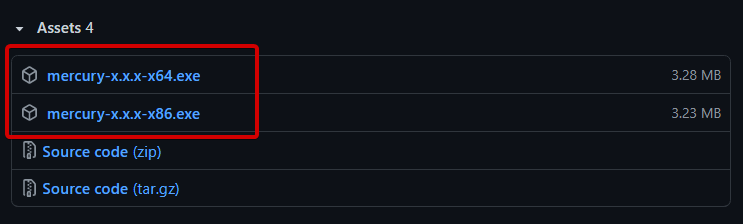
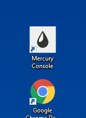

# Introduction

Mercury is a package manager for your Halo Custom Edition installation. It allows you to
download, install and remove different packages for the game, those packages can be a map mod, a new DLL addon, a script, some config files, etc.

Any kind of mod, map, DLL, script or even config files can be contained in something called **package**.

Mercury is a CLI program, so it is designed to be used on a terminal, it attempts to simplify installation and solve user issues at installing complex structured mods, also providing on demand mods by storing and providing installation of different **packages** from our repository.

# Installation

In order to install Mercury you need to download the installer from the [GitHub releases page](https://github.com/Sledmine/Mercury/releases/).

Make sure that your downloading the latest version available, installation is pretty straightforward, look for the installer that matches your operative system.

## On Windows

If you are on Windows the installation should be pretty simple, just download the installer and follow the instructions from it, classical endless next button.



After finishing installation you will find a new shortcut on your desktop like the one below:




Now you can open this shortcut and start typing Mercury related commands, **WARNING** this console window will ask for user elevation (admin permissions), do not type commands that are not related to Mercury here.

If you don't have Halo Custom Edition on a folder that requires elevation you can type mercury commands from any other console or terminal that has access to your PATH variable.

To verify that everything is running correctly you can use this command to see information about Mercury:

```cmd
mercury about
```

## On Linux

For Linux users there should be a bin file ready to use, place it on a place of your choice and add it to your PATH in order to start using it.

You can drop it on your user bin folder and that should be all, adding a new folder to your PATH should not be required.
```bash
mv /home/117/Downloads/mercury /usr/bin/mercury
```