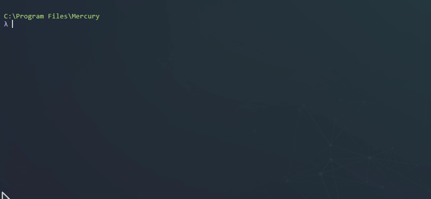

<html>
    <p align="center">
        
    </p>
    <h1 align="center">Mercury</h1>
    <p align="center">
       Halo Custom Edition Package Manager
    </p>
    <p align="center">
       v2.0.0-beta
    </p>
</html>

# Introduction

Mercury is console program that provides you some cool features for Halo Custom Edition such as downloading and installing addons, maps and mods in general for your Halo Custom Edition game, everything you need stored in a repository, a unique place, all being downloaded in a pure developer style, in other words basically a software package manager oriented to a game that has mods.



# What is the purpose of Mercury?

Mercury attempts to solve the problem of descentralized content available out there for the game, it tries to bring a way to simplify the deployment and publishing issues that a modder of the game can encounter at trying to release a mod for the community, we can say Mercury "simplifies" the installation process as some users are not friends of a command line but it is better
than trying to explain how to install everything on a mod manually.

In short terms what it offers you:
- Get access into our package repository and download the latest or the specified version of your favorite packages/mods by using simple commands.
- Manage your favorite mods or addons, performing different actions on them, remove, update, etc

We tried to minimize the impact of how complex a package manager really is based on how the game is
actually really hard to keep stable by installing different mods that are not compatible with each other, the final "build" of Mercury is your Halo files installation so we provide you with a way
to know (when possible) if a package you are trying to install is not compatible with another package already installed in your game, but you have responsability to decide what packages you want
to keep installed in order to install one package or another.

# Installing Mercury

To download and use Mercury in your computer you have to download Windows binaries from the [releases](https://github.com/Sledmine/Mercury/releases) tab or from the official site, there is an installer for easier setup.

# Documentation

We are working on some documentation for Mercury, stay tuned, some markdowns will be hosted here as
well:

- [Lua Bundler](docs/LUA-BUNDLER.md)
- [Mercury Packages](docs/PACKAGES.md)

# Contribute to Mercury

Feel free to fork and ask for pull requests to this repository, we are looking for an interface application for Mercury so any frontend developer is welcome!

# Building Mercury

Mercury uses [luapower](https://luapower.com) as the base of the project, it is needed to get the required amount of modules and files to bundle/compile the code in this repository.

Mingw-w64 is required to compile the project, at least for Windows builds.

- [Mingw-w64](http://mingw-w64.org/doku.php)

There are some extra modules are required for the project that are not in the luapower distribution, they are already included on my luapower fork called
[luapower-all-x86-x64](https://github.com/Sledmine/luapower-all-x86-x64):


**NOTE:** Use my luapower fork to bundle this project always, it has all the changes needed by 
Mercury to compile.

After setting up all the requirements be sure to have permission to create symlinks on your main
drive as the compilation script requires them right now to acomplish multi arch compilation
(better ideas about how to deal the compilation proccess are welcome).

Using ths command should be enough to compile this repository (assuming the repository folder is
inside the luapower folder as well):
```cmd
cd luapower-all-x86-x64
luajit mercury/compile.lua
```

**NOTE:** I'll try to create a docker container for this, it should simplify compilation process and
provide a way to automatically build this on the cloud.

# Setting up a development environment

If you want to modify and test code in this repository you will have a couple of tools to
test everything in your local environment, some unit testing is being added continuously.

## Run Mercury from source
Luapower follows a structure where everything must be inside the root folder to work, by just making
a Symlink of your cloned respository into the Luapower folder you will be able to run, you can
clone your repository directly in the Luapower folder but we would like to recommend you to create a
symlink.

After that you can just use this command in the luapower folder to run it:
```cmd
./luajit mercury/mercury.lua
```

## Mocking Vulcano API and Server

Vulcano is the API that Mercury consumes, as Vulcano is a really simple HTTP JSON Server we don't
have documentation about it, but if you got this far to start working on Mercury it would be a really simple API to test and consume based on the Mercury code.

You can run a mock of Vulcano API including static package repository using
[easymock](https://github.com/CyberAgent/node-easymock) and the commands below:
```cmd
cd tests/server
easymock
```

# FAQ

## I use a portable version of Halo Custom Edition, can I use Mercury?

Yes, you can by setting a environment variable pointing to your Halo Custom Edition path,
environment variables have a different way for being set on Linux and Windows:

On Linux:
```bash
export HALO_CE_PATH="/home/.wine/drive_c/Halo Custom Edition"
export HALO_CE_DATA_PATH="/home/Documents/My Games"
```
Do not forget to add those lines to your .bashrc or .zshrc file make them permanent variables.

On Windows:
```cmd
set HALO_CE_PATH=D:\Games\Halo Custom Edition
set HALO_CE_DATA_PATH=D:\Users\Sledmine\Documents\My Games\Halo CE
```
These variables will not remain permanent, look into how to set them permanently.